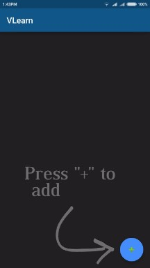
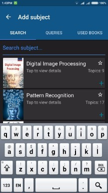
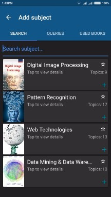
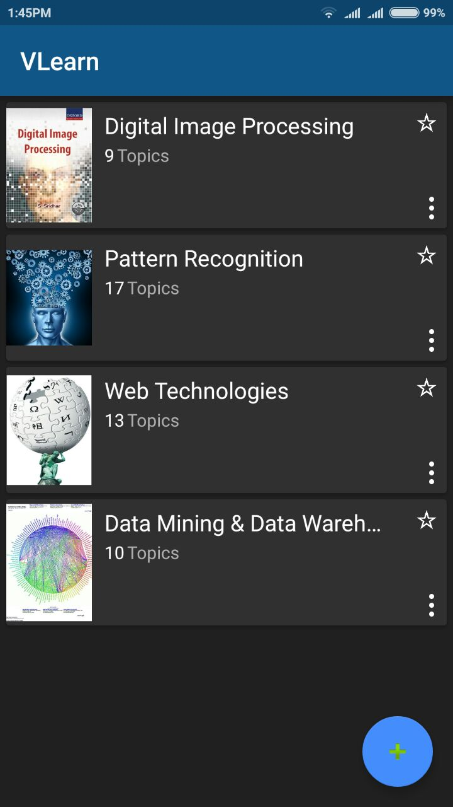
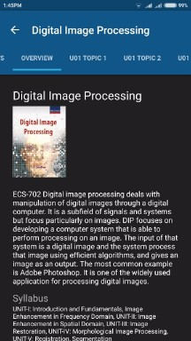
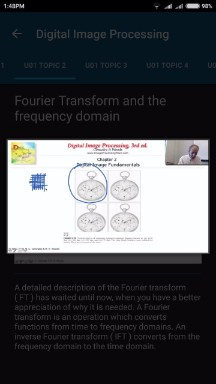
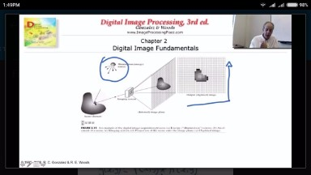
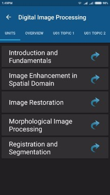
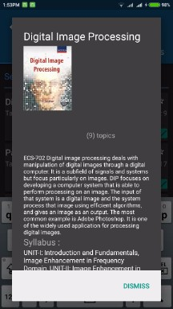

# VLearn
VLearn is an android application that enables students from AKTU to watch video lectures specific to their courses, on the go! Students can either add all subjects to their account just by entering their university roll number, or they can manage their subjects manually using an easy to use interface.

(I pulled down this app from playstore since maintaining the database was costing me money)

All the code written by me is present in the following folder : app/src/main

Here are some screenshots of the application :

      

      

      

   
